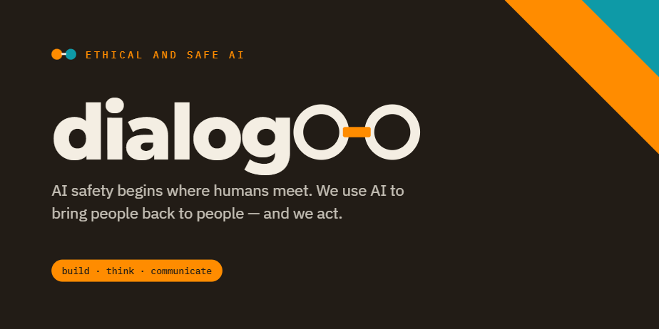
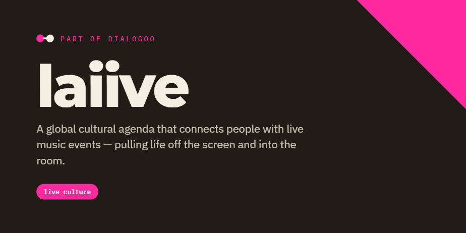
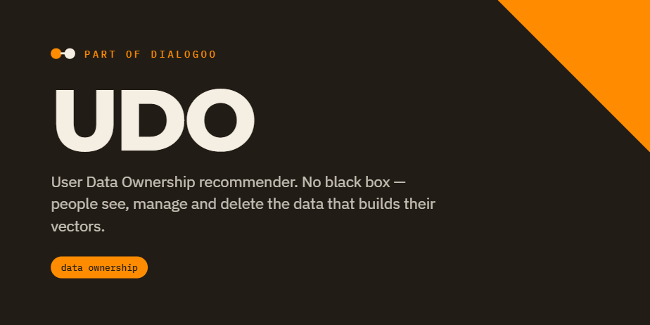

<!-- profile/README.md — dialogoo org profile -->

  

  
  
  

> **this README.md IS A TEMPORARY DRAFT** until the publication of dialogoo white paper.
> Dialogoo is an open project, suggestions, contributions and collaborations are very wellcome.

# dialogoo

## Ethical and safe AI

#### At Dialogoo, we ACT as a core value.

Dialogoo was born as a natural response to digital imbalance, under the critical assumption that as digital systems become more intelligent, digital imbalance amplifies certain disruptive social risks. Dialogoo is open to any ethical AI initiative and ready to pivot if the times require it.

We are aware that the digital layer grows thicker every day. A digital intermediate layer is expanding between human connections, and the models and agents managing those connections are becoming increasingly powerful. We refuse to remain passive while this unfolds. So we think critically, take a position, and above all, we act. That is what Dialogoo is about: we build with AI ethically. We don't remain in theory, we take ethical action.

---

## Approach

Some forecasts predict transformative AI within years, not decades. If that is the case, we may be unprepared for the effects. We cannot wait for perfect research or policy.

The risk is not distant superintelligence. It has already started: the slow erosion of human agency is happening right now.

**1st line of action, immediate:** We propose fast action where physical and local networks serve as the safety net. We build AI systems that contribute to strengthening the physical layer urgently, before AGI and digital imbalance create a critical combination.

**2nd line of action:** Technical research on safety layers.

**3rd line of action:** Research and communication, we use data, real examples, and red-teaming scenarios to build critical mass and pressure decision-makers to act accordingly.

---

## How We Apply AI

We turn the algorithmic loop into a bridge toward real life. AI is used not as an addictive form of interaction, but to bring people back to people, pulling users from infinite scrolling and dopamine drain into face-to-face socialization and public life. We return data ownership to users and ensure its security to prevent deep manipulation.

---

## What We Do

**Build:** Applied projects.
**Think:** Applied research.
**Communicate:** Analytics and storytelling focused on policy change.

---

## Why

Because it is too risky to rely on a digital network where control could be captured.
Because AI safety begins where humans meet.

---

## Core Values

### At Dialogoo, we:

* Use AI to reconnect, not to trap.
* Understand physical networks and communities as a resilience layer for a healthy system.
* Keep humans, cultures, and communities at the center.

### We don't:

* Build artificial companions.
* Optimize for engagement or addiction.
* Replace real relationships with simulation.
* Sell people's lives or intimacies in any data format.

We build tools for balance, not distraction.

---

## Join Us

Dialogoo is an open umbrella for those who act.
Builders. Researchers. Artists. Educators.
Anyone who believes AI safety needs to move fast.

---

## What's Next

A white paper is in progress to ground these ideas in data, research, and methodology.
Until then: prototype, connect, and share.
The work is urgent. The invitation is open.

---

## Projects

[laiive](https://github.com/dialogoo/laiive/tree/main) is the first project under the Dialogoo umbrella. Some of the services built behind laiive are being developed as project-agnostic, so they can be used by other projects to extend Dialogoo's values.

  

---

## Open Source Packages

[AI Safety Guardrails](https://github.com/dialogoo/AI-Safety-Guardrails), AI Safety Guardrails is a modular, production-ready package that adds layered protection around LLM applications across the full lifecycle of a request. It applies safety checks at four stages: input, processing/tool calls, output, and policy/compliance. The mision is reduce risks like PII leakage, prompt injection, unsafe tool use, and harmful responses before they reach users.

Its relevance is in this defense-in-depth design: each layer catches different failure modes, while audit logging and compliance modules (EU AI Act, NIST AI RMF) provide traceability and governance for real-world deployment.

[UDO Recommender System](https://github.com/dialogoo/UDO), UDO stands for User Data Ownership. No black box manipulates users: they are aware of what they share or privately use to feed the recommender system, and can delete or modify it at any time.

  

---

## White Paper

[Dialogoo White Paper](https://github.com/dialogoo/dialogoo-whitepaper)

---
**dialogoo** · ethical and safe AI · the work is urgent, the invitation is open · <a href="https://github.com/dialogoo">github.com/dialogoo</a>
